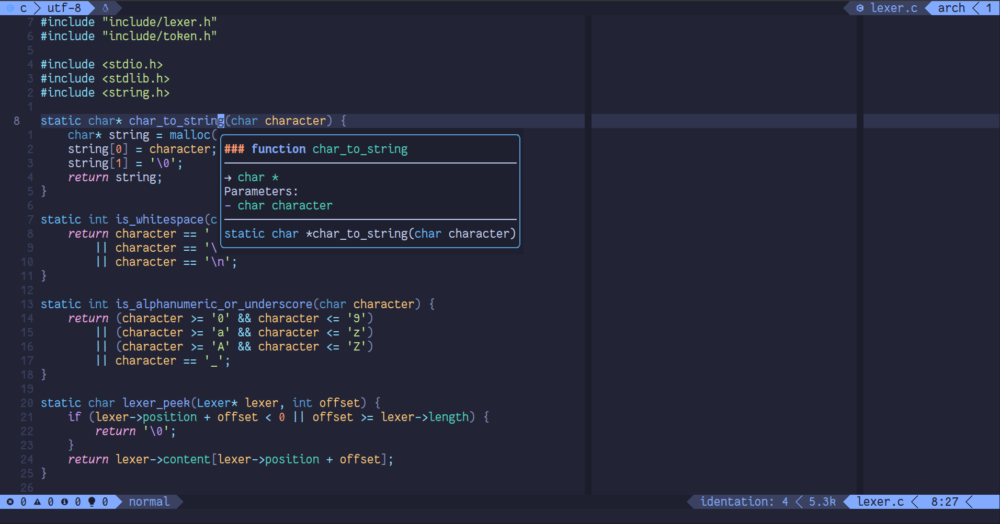

## Neovim Configuration

Personal neovim configuration, written from scratch.

### Features it has

- File browser, fuzzy finding and live grep.
- Syntax highlighting.
- Diagnostics, completion and linting.
- Git integration.
- AI integration.

### Features it hasn't

- File Tree. Use netrw or telescope file browser.
- Autopairs. Don't you know how to type?
- Snippets. Because they're annoying.

## Screenshot

